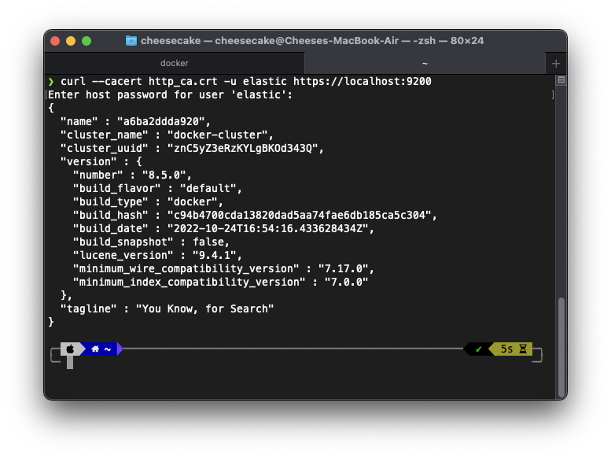
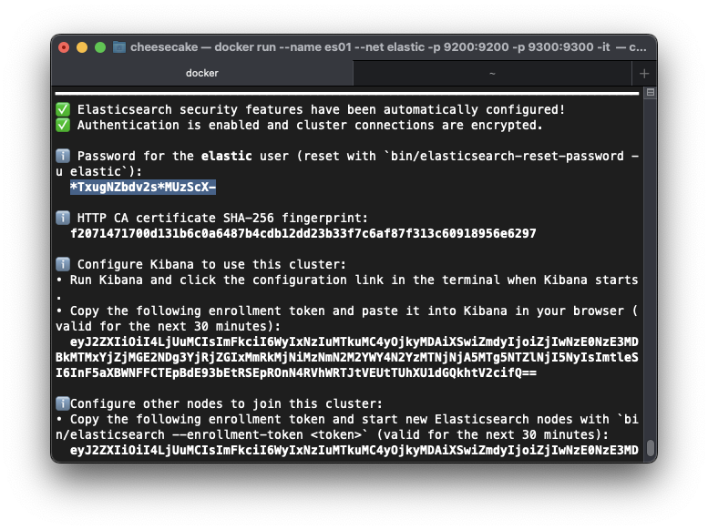

# Childhood-Illness-Search-Engine

"Childhood Illness Search Engine" is a cross-platform app built with Flutter that allows users to search for potential illnesses by inputting a description of their symptoms. The app is divided into two parts: a frontend built with Flutter and a backend built with the Python framework Flask. It is designed to help parents and caregivers quickly identify potential health issues in children and seek medical attention if necessary. The app is a valuable resource for those looking to quickly and accurately diagnose and treat illnesses in young children.

- [Installation Instructions](#installation-instructions)
  - [Elasticsearch server](#2-start-elasticsearch-server)
  - [Backend server](#3-start-backend-server)
  - [Kibana (Optional)](#run-kibana-optional)
- [Usage Instruction](#usage-instructions)
- [Workflow of Codes](#workflow-of-codes)
- [Credits and Acknowledgements](#credits-and-acknowledgements)

## Installation Instructions

### 1. Get the Source Code

Clone or download the source code from the repository.

### 2. Start Elasticsearch Server

#### Install Docker Desktop or Docker Engine

Install the appropriate <a href="https://docs.docker.com/get-docker/">Docker application</a> for your operating system.

NOTE: Make sure that Docker is allotted at least 4GiB of memory. In Docker Desktop, you configure resource usage on the Advanced tab in Preference (macOS) or Settings (Windows).

#### Pull the Elasticsearch Docker image

Obtaining Elasticsearch for Docker is as simple as issuing a docker pull command against the Elastic Docker registry.

```bash
$ docker pull docker.elastic.co/elasticsearch/elasticsearch:8.5.0
```

#### Start a single-node cluster with Docker

The following commands start a single-node Elasticsearch cluster for development or testing.

1. Create a new docker network for Elasticsearch

```bash
$ docker network create elastic
```

2. Start Elasticsearch in Docker. A password is generated for the elastic user and output to the terminal.

```bash
$ docker run --name es01 --net elastic -p 9200:9200 -p 9300:9300 -it docker.elastic.co/elasticsearch/elasticsearch:8.5.0
```

3. Copy the generated password token and save them in a secure location. These values are shown only when you start Elasticsearch for the first time.

4. Copy the `http_ca.crt` security certificate from your Docker container to your local machine.

```bash
$ docker cp es01:/usr/share/elasticsearch/config/certs/http_ca.crt .
```

NOTE: Do remember the path you copy `http_ca.crt` from this step because it will copy file to the current path.

You can check the current path by using `pwd` and `ls` to see that `http_ca.crt` is in this path.

```bash
$ pwd
/Users/cheesecake
$ ls
Applications        Library             Public              nltk_data
Desktop             Movies              StudioProjects      sketchybarrc
Documents           Music               zshrc
Downloads           Pictures            http_ca.crt
IdeaProjects        Postman
```

5. Open a new terminal and verify that you can connect to your Elasticsearch cluster by making an authenticated call, using the `http_ca.crt` file that you copied from your Docker container. Enter the password for the elastic user when prompted.

```bash
curl --cacert http_ca.crt -u elastic https://localhost:9200
```

It should show some result like following image if it work correctly.



### 3. Start Backend Server

1. Make server folder to be virtual environment (venv). Make sure that that current path is root of repo

```bash
$ pwd
/path/to/GitHub/Childhood-Illness-Search-Engine
$ ls
README.md  client  design  server
# if you don't already have virtualenv installed
$ pip install virtualenv
$ virtualenv server
```

2. Access server path. Install all requirements

```bash
$ cd server
$ pwd
/path/to/GitHub/Childhood-Illness-Search-Engine/server
$ source bin/activate
$ pip install -r requirements.txt
```

3. Access to app folder, create `.env` file in /app/.env to store elastic password and ca certificate path.

```bash
$ cd app
$ pwd
/path/to/GitHub/Childhood-Illness-Search-Engine/server/app
$ touch .env
```

4. Edit `.env` file. You can use any text editor to open and it. Insert the following text.

```python
# Password for the 'elastic' user generated by Elasticsearch
# NOTE: Don't forget to change to be compatible with your environemnt
ELASTIC_PASSWORD = "password_of_elastic"
CA_CERTS_PATH = "~/http_ca.crt"
```

NOTE 1: Please make sure that you are running elasticsearch by instruction provided above. See <a>Start Elasticsearch Server</a>

NOTE 2: Do not forget to replace `password_of_elastic` to be current password. The password can be found in terminal running elasticsearch. For example, based on image below, the password is `*TxugNZbdv2s*MUzScX-`



The final file of `.env` will be look like this:

```python
# Password for the 'elastic' user generated by Elasticsearch
# NOTE: Don't forget to change to be compatible with your environemnt
ELASTIC_PASSWORD = "*TxugNZbdv2s*MUzScX-"
CA_CERTS_PATH = "~/http_ca.crt"
```

5. Access back to server folder.

```bash
$ cd ..
$ pwd
/path/to/GitHub/Childhood-Illness-Search-Engine/server
```

6. Run in **local** device

```bash
python3 app/app.py
```

or

```bash
python app/app.py
```

6. (**Optional**) Run [**local**] in development mode. This step require to install nodejs and nodemon package.

```bash
nodemon --exec python3 app/app.py
```

### Run Kibana (Optional)

Use Kibana to test and visualize the data in the Elasticsearch server

#### Start Kibana

Kibana enables you to easily send requests to Elasticsearch and analyze, visualize, and manage data interactively.

1. In a new terminal session, start Kibana and connect it to your Elasticsearch container:

```bash
docker pull docker.elastic.co/kibana/kibana:8.5.0
docker run --name kibana --net elastic -p 5601:5601 docker.elastic.co/kibana/kibana:8.5.0
```

When you start Kibana, a unique URL is output to your terminal.

2. To access Kibana, open the generated URL in your browser.

- Paste the enrollment token that you copied when starting Elasticsearch and click the button to connect your Kibana instance with Elasticsearch.

- Log in to Kibana as the elastic user with the password that was generated when you started Elasticsearch.

## Usage Instructions

1. Start the Elasticserver and backend server as described in previous section.
2. Start the app by using **Android Studio** or **Visual Studio Code**.
3. When the app is successfully run on any platform, user can search the list of potential illnesses by inserting the symptoms as a input in search box.
4. When click search icon, the system will return the list of illnesses in a second.
5. User can directly reedit the input to start searching again or click **X** icon to remove all string input.

## Workflow of Codes

When the backend server is started, it performs the following actions:

1. Normalizes the data from the provided CSV files using Nltk.
2. Loads the normalized data into Elasticsearch.
3. Listens for client input in the form of a symptom description string in frontend part.
4. Normalizes the input using Nltk.
5. Searches Elasticsearch for a match based on the normalized input.
6. Returns a list of potential illnesses and their associated symptoms as an API.
7. the frontend receives data via an API and display to the client.

## Credits and Acknowledgements

We would like to acknowledge the following resources and libraries that were used in the development of this project:

[Flutter](https://flutter.dev): A mobile app development framework used for the frontend of the app.
[Flask](https://flask.palletsprojects.com/en/2.2.x/): A Python framework used for the backend of the app.
[Elasticsearch](https://www.elastic.co): A search engine used to index and search the data in our database.
[Nltk](https://www.nltk.org): A library for natural language processing used to parse and analyze user input.
[Pandas](https://pandas.pydata.org): A library for data manipulation and analysis used to process and clean the data in our database.

We used data from the following external source to populate our database:

[Nidirect](https://www.nidirect.gov.uk/conditions/childhood-illnesses): the website containing illnesses information that we extracted and formatted into a CSV file for use in the app.

We would also like to extend our gratitude to the following individuals who contributed to this project:

- [Sinut Wattanarporn]()
- [Nipphit Apisitpuwakul]()
- [Atchaya Srimongkolthana]()
- [Phuritat Wijitluksana]()

This project would not have been possible without the support and guidance of these resources and individuals. Thank you!
